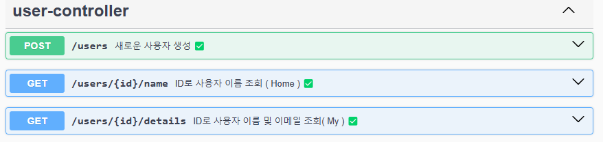
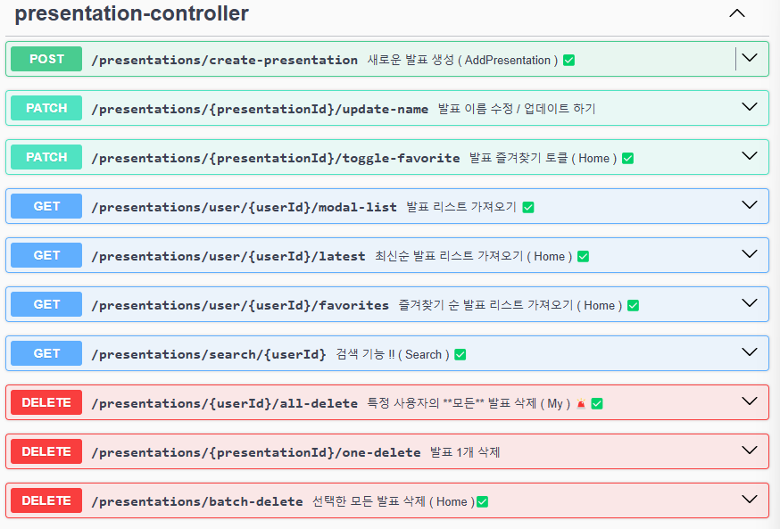
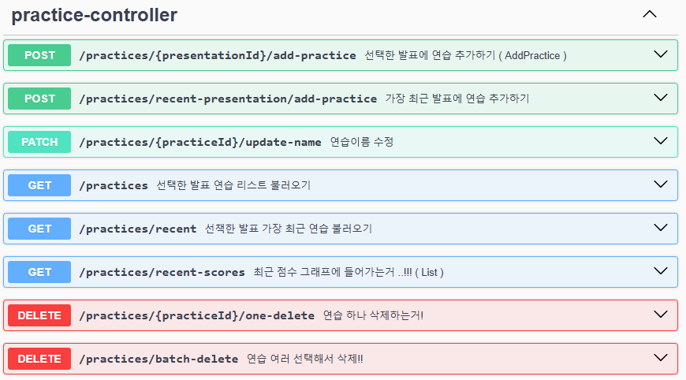
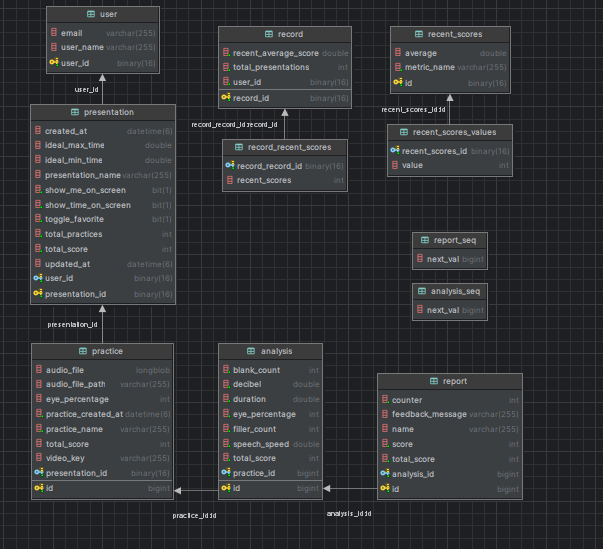

# pree_BE


> **_영상 분석을 통한 발표 피드백 iOS 서비스_** <br/><br/>
> **Development Period: 2024.12.16 ~ 2025.01.03**

<br/>

## Service Introduction

발표 연습 영상을 기반으로 말의 속도, 목소리 크기, 시선 처리 등 <br/>
다양한 요소를 분석하여 객관적인 맞춤형 피드백을 제공합니다. <br/>
이를 통해 사용자의 발표 전달력을 효과적으로 향상시켜주는 서비스입니다.

**💬 As-Is**

1. 발표 연습을 반복해도 자신의 약점 파악이 어렵고, 스스로 객관적인 피드백을 할 수 없어서 발표력을 개선하지 못한다.
2. 중요한 발표에서 전달력이 부족해 경력 성장과 성과 달성 기회를 놓친다.

**💬 To-Be**

1. 발표 영상을 촬영하기만 해도, 객관적이고 구체적인 발표 분석과 맞춤형 피드백을 받아 효과적으로 연습할 수 있다.
2. 객관적이고 체계적인 분석 결과와 개선 팁을 기반으로 한 반복 연습을 통해 자신감을 강화하고, </br> 향상된 발표력으로 중요한 발표에서 성과를 높여 경력 성장 기회를 확대한다.

## Function

### **1. 최근 연습에 대한 항목별 평균 지표 제공 📊**

1. 최근 5개의 연습 영상을 통해 분석한 데이터를 바탕으로 pree에서 제공하는 항목별 평균 지표를 그래프로 제공합니다. 

### **2. 발표영상 촬영 및 분석 💡**

1. 탭바의 + 버튼 클릭시, 새로운 발표를 추가하거나, 기존 발표에서 연습 영상을 추가할 수 있습니다.
2. 사용자가 설정한 최소 시간/최대 시간, 아이트래킹, 음성 데이터 등을 이용하여 발표 영상을 분석합니다.
   
### **3. 분석 데이터에 대한 레포트 제공 💬**

1. 영상 촬영 후 분석이 끝나면 해당 발표에 대한 레포트를 제공합니다.
2. 발표시간, 목소리 크기, 발화 지연 표현 횟수, 불필요한 공백 횟수, 시선처리에 대한 점수 및 측정 결과를 제공합니다.

## 페이지별 소개

<table align="center">
<tr>
<th>Splash</th>
<th>Home</th>
<th>Search</th>
<th>My</th>
</tr>
<tr>
<td align="center">


</td>
<td align="center">


</td>
<td align="center">


</td>
<td align="center">


</td>
</tr>
</table>

<table align="center">
<tr>
<th>Record1</th>
<th>Record2</th>
<th>Record3</th>
</tr>
<tr>
<td align="center">


</td>
<td align="center">


</td>
<td align="center">


</td>
</tr>
</table>

<table align="center">
<tr>
<th>Practice</th>
<th>Report</th>
</tr>
<tr>
<td align="center">


</td>
<td align="center">


</td>
</tr>
</table>
<br/>

##  팀 에스파드 

------
|                                                   이지환                                              |                          김규희                           |                          김나임                           |     
|:-----------------------------------------------------------------------------------------------------:|:---------------------------------------------------------:|:---------------------------------------------------------:|
|                                                  PM                                                   |                            디자인                             |                           백엔드                            |
|    |     |  |
|                                                김도경                                                 |                                 이유현                    |                          김도원                           |
|                                                  프론트엔드                                                  |                           프론트엔드                           |                           프론트엔드                           |
|  |  |  |


<br/>

# BACKEND 기술 스텍

### FrontEnd

  
  

### BackEnd


### 협업도구


<br />


<br/>

# 💻 간단한 블로그 플렛폼 API

## 기능:

1. **[유저 관리](#1-user-feature-testing)**
  - **유저 추가**
  - **유저 조회**
  - **유저 정보 엡데이트**
  - **유저 삭제**

2. **[계시글 관리](#2-post-feature-testing)**
  - **계시글 작성**
  - **하눈에 모든 계시글 보기**
  - **ID 로 계시글 불러오기**
  - **계시글 수정**
  - **계시글 삭제**

3. **[좋아요 기능](#3-like-feature-testing)**
  - **좋아요 토글** (Users can like or unlike a post)
  - **Retrieve Like Count** (See the total number of likes for each post)

### Swagger 화룡앟여 test 하기
'http://localhost:8080/swagger-ui/index.html#/'

---

## 1. **User Feature Testing**

<table>
<tr>
<td>
  
#### a. **유저 추가하기r**
- **Endpoint**: `POST /user`
- **Try it out json**:
 
     ```json 
     {
       "name": "Naim Kim"
     }
     ```
  - **Results 👉👉👉**

</td>
<td>



</td>
</tr>

<tr>
<td>

#### b. **유저 조회하기 by ID**

- **Endpoint**: `GET /user/{userId}`
- **Try it out**.
  - Execute with a valid `userId`.
- **Results 👉👉👉**

</td>
<td>



</td>
</tr>

<tr>
<td>

#### c. **유저 정보 엡데이트**

- **Endpoint**: `PATCH /user/{userId}`
- **Try it out json**.
     ```json
     {
       "name": "Naanim Kim"
     }
     ```
- **Results 👉👉👉**

</td>
<td>



</td>
</tr>
</table>

---

## 2. **Post Feature Testing**

<table>
<tr>
<td>

#### a. **Create a Post**

- **Endpoint**: `POST /post/{userId}`
- **Try it out json**.
     ```json
     {
       "title": "오늘의 일기",
       "content": "피곤하다."
     }
     ```
- **Results 👉👉👉**

</td>
<td>



</td>
</tr>

<tr>
<td>

#### b. **하눈에 모든 계시글 보기**

- **Endpoint**: `GET /post`
- **Results 👉👉👉**

</td>
<td>


</td>
</tr>

<tr>
<td>

#### c. **ID 로 계시글 불러오기**

- **Endpoint**: `GET /post/{postId}`
- **Execute**.
- **Results 👉👉👉**

</td>
<td>


</td>
</tr>

<tr>
<td>

#### d. **Update a Post**

- **Endpoint**: `PATCH /post/{postId}/{userId}`
- **Try it out json**.
     ```json
     {
       "title": "어제 예언의 확신",
       "content": "피곤하다."
     }
     ```
- **Results 👉👉👉**

</td>
<td>


</td>
</tr>

<tr>
<td>

#### e. **Delete a Post**

- **Endpoint**: `DELETE /post/{postId}/{userId}`
- Select wnated post and Execute.
- **Results 👉👉👉**

</td>
<td>


</td>
</tr>

</table>

---

## 3. **Like Feature Testing**

<table>
<tr>
<td>

#### a. **Toggle Like on a Post**

- **Endpoint**: `POST /like/{postId}/{userId}`
- Enter postId and userId to toggle like
- **Results 👉👉👉**

</td>
<td>


다시 "누른다면"

</td>
</tr>
</table>

---

