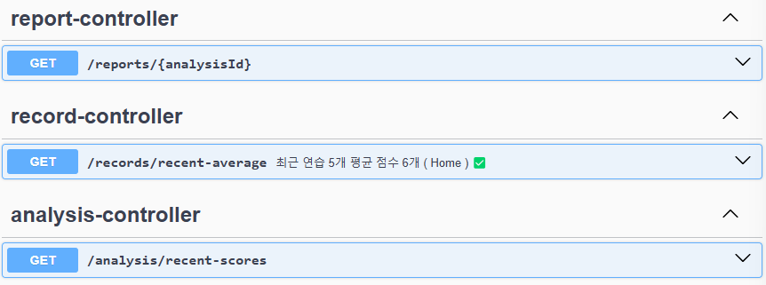

# pree_BE

> **_영상 분석을 통한 발표 피드백 iOS 서비스_**   
> **Development Period: 2024.12.16 ~ 2025.01.03**

 

## Service Introduction

발표 연습 영상을 기반으로 말의 속도, 목소리 크기, 시선 처리 등  
다양한 요소를 분석하여 객관적인 맞춤형 피드백을 제공합니다.  
이를 통해 사용자의 발표 전달력을 효과적으로 향상시켜주는 서비스입니다.

**💬 As-Is**

1. 발표 연습을 반복해도 자신의 약점 파악이 어렵고, 스스로 객관적인 피드백을 할 수 없어서 발표력을 개선하지 못한다.
2. 중요한 발표에서 전달력이 부족해 경력 성장과 성과 달성 기회를 놓친다.

**💬 To-Be**

1. 발표 영상을 촬영하기만 해도, 객관적이고 구체적인 발표 분석과 맞춤형 피드백을 받아 효과적으로 연습할 수 있다.
2. 객관적이고 체계적인 분석 결과와 개선 팁을 기반으로 한 반복 연습을 통해 자신감을 강화하고,   향상된 발표력으로 중요한 발표에서 성과를 높여 경력 성장 기회를 확대한다.

## Function

### **1. 최근 연습에 대한 항목별 평균 지표 제공 📊**

1. 최근 5개의 연습 영상을 통해 분석한 데이터를 바탕으로 pree에서 제공하는 항목별 평균 지표를 그래프로 제공합니다. 

### **2. 발표영상 촬영 및 분석 💡**

1. 탭바의 + 버튼 클릭시, 새로운 발표를 추가하거나, 기존 발표에서 연습 영상을 추가할 수 있습니다.
2. 사용자가 설정한 최소 시간/최대 시간, 아이트래킹, 음성 데이터 등을 이용하여 발표 영상을 분석합니다.
   
### **3. 분석 데이터에 대한 레포트 제공 💬**

1. 영상 촬영 후 분석이 끝나면 해당 발표에 대한 레포트를 제공합니다.
2. 발표시간, 목소리 크기, 발화 지연 표현 횟수, 불필요한 공백 횟수, 시선처리에 대한 점수 및 측정 결과를 제공합니다.

## 페이지별 소개

<table align="center">
<tr>
<th>Splash</th>
<th>Home</th>
<th>Search</th>
<th>My</th>
</tr>
<tr>
<td align="center">

</td>
<td align="center">

</td>
<td align="center">

</td>
<td align="center">

</td>
</tr>
</table>

<table align="center">
<tr>
<th>Record1</th>
<th>Record2</th>
<th>Record3</th>
</tr>
<tr>
<td align="center">

</td>
<td align="center">

</td>
<td align="center">

</td>
</tr>
</table>

<table align="center">
<tr>
<th>Practice</th>
<th>Report</th>
</tr>
<tr>
<td align="center">

</td>
<td align="center">

</td>
</tr>
</table>
 

##  팀 에스파드 

------
|                                                   이지환                                              |                          김규희                           |                          김나임                           |     
|:-----------------------------------------------------------------------------------------------------:|:---------------------------------------------------------:|:---------------------------------------------------------:|
|                                                  PM                                                   |                            디자인                             |                           백엔드                            |
|    |     |  |
|                                                김도경                                                 |                                 이유현                    |                          김도원                           |
|                                                  프론트엔드                                                  |                           프론트엔드                           |                           프론트엔드                           |
|  |  |  |

 

## 💻 FrontEnd Tech Stack

  
  

## 👥 협업도구

 

 

## 🛠️ Backend

+ TarsosDSP - 오디오 분석 Java Library
+ AWS Transcribe - STT ( Speech to Text )

### 1. **User**

<table>

<tr>

</tr>
<tr>

 유저 생성 + 유저별 데이타 관리
</tr>

</table>

---

### 2. **Presentation**

<table>

<tr>

</tr>
<tr>

- 유저별 발표생성
- 발표 리스트 불러오기
  - 최신순
  - 중요도 표시순
- 발표 이름 변경 / 중요도 토글 
- 발표 삭제
  - 개별삭제
  - 여러개 한번에 선택 삭제
  - 유저 내 모든 발표 삭제

</tr>

</table>

---

### 3. **Practice**

<table>

<tr>

</tr>
<tr>

- 연습 생성 
  - 최금 발표에 새로운 연습 추가
  - 선택한 발표에 연습 추가
- 연습 리스트 불러오기
- 최근 연습 별 점수 불러오기
- 연습 이름 변경
- 연습 삭제
  - 개별 삭제
  - 여러 연습 선택후 삭제

</tr>

</table>

---

### 4. **Analysis + Report**

<table>

<tr>

</tr>
<tr>

- 새로운 연습 추가시 Analysis 생성 후 각 항목별 Report 생성

</tr>

</table>

## 🚩ERD (Entity Relationship Diagram)

